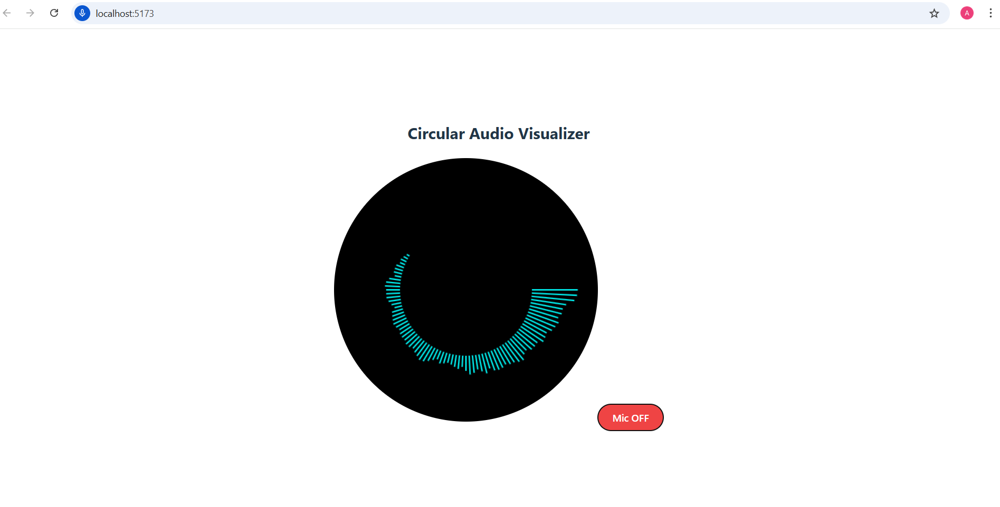
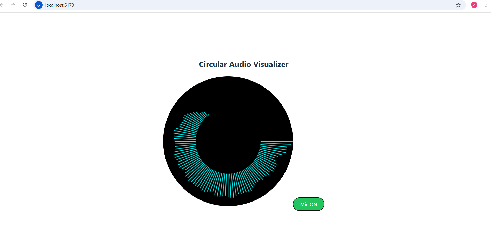

🎵 Circular Audio Visualizer

A real-time Circular Audio Visualizer built using React (Vite) that captures microphone input and visualizes audio frequencies in a circular waveform.
The application includes a Mic ON / Mic OFF toggle button to control audio input dynamically.

🚀 Features

🎤 Live Microphone Input

🔄 Real-time Circular Audio Visualization

🔘 Mic ON / OFF Toggle Button

🖥️ Clean & Centered UI

⚡ Built with React + Vite

🔌 Optional WebSocket support for streaming audio data to backend

🛠️ Tech Stack
-Frontend

-React (Vite)

-JavaScript (ES6+)

-HTML5 Canvas

-Web Audio API

-CSS

-Backend (Optional)

-Spring Boot

-WebSocket (Netty)

-Java

How to Run the Project
1️⃣ Frontend Setup
cd circular-audio
npm install
npm run dev

Open browser:

http://localhost:5173

2️⃣ Backend Setup (Optional – for WebSocket)

cd backend
./mvnw spring-boot:run
Backend runs on:

arduino
Copy code
http://localhost:8081
WebSocket endpoint:

bash
Copy code
ws://localhost:8081/ws/audio
🎛️ Mic Control
Mic ON → Starts microphone & audio visualization

Mic OFF → Stops microphone input

Visualizer responds instantly to audio levels

📸 Output Screenshots
🔴 Mic OFF

(No audio input – visualization inactive)

🟢 Mic ON

(Live audio visualization from microphone)

👨‍💻 Author

Akshay Tomer
Full Stack Developer
